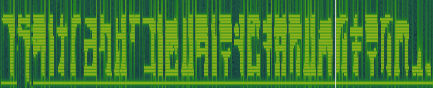

# Hey, Listen! Writeup

TODO: Pictures of Hylian characters

We didn't really notice any distortions when listening to the track, so we took a look at the spectrogram of the track, since this is a common place to hide information in audio files. The audio starts with an audio clip from the well-known Zelda character Navi saying "Hey, listen!", followed by a song from The Legend of Zelda: The Wind Waker. (https://youtu.be/SXGGvsHq6iA).

The audio track is quite long, but in the middle we see the following spectrogram:



It looks like some sort of weird script, so we should probably turn to Google to do some research. Many different games, series, etc. have their own fictional languages, and since the theme of this challenge is Zelda-related it is probably a good idea to look for resources pertaining to languages in the Zelda games. After Googling for "Zelda scripts", "Zelda languages", etc, these three links came up:
* [Hylian Language](http://zelda.wikia.com/wiki/Hylian_Language)
* [Hylian Language (gamepedia)](https://zelda.gamepedia.com/Hylian_Language)
* [Zelda Fonts](https://zeldauniverse.net/media/fonts/)

In the Zelda series, there have been many different versions of the Hylian language. Following is a list of the languages and the games they appear in:
* First Hylian
    * A Link to the Past
* Second Hylian
    * Ocarina of Time 
    * Majora's Mask
* Third Hylian
    * The Wind Waker
* Fourth Hylian
    * Twilight Princess
    * Skyward Sword
* Fifth Hylian
    * Skyward Swort
* Sixth Hylian
    * A Link Between Worlds
    * Breath of the Wild

Based on the fact that the song comes from The Wind Waker, and after comparing all the different scripts with the one in the spectrogram, we can conclude that this is the third hylian script.

We start by matching the easiest characters:


The remaining characters are a bit harder to compare with the table, but they all look like diacritics. For the first missing character, the only one with the same shape at the bottom is gu.png). This leaves us with the following message: . Also note that the first three characters now spell "furagu". If we turn this into Japanese characters and throw it into Google translate, we see that it is translated into "flag"! If we put the Japanese equivalent of the characters into Google translate up until the `「` character, we get the following translation:
```
フラグの内容は -> The content of the flag is
```

Seems like we're on the right track! Note that we used the recommended translation from Google, or else we wouldn't know what kanji to use.

For the next character we also look at the bottom part, leading us to ze. The next one looks either like za or da. The next unknown character looks like de based on the bottom part. It could also be ji, but that's more unlikely. This character is also used at the end of the message. Following is a character that looks like either ba or pa. If we take a look at the top of the character, it looks a bit different from gu, which has three lines on top. This means that it's most likely a pa.

The character adjacent to this one looks like zu. The final character is tricky, but looks like a ga because of the length of the "legs", and that it looks like there's a dot between them. We're now left with the following message .

Now we have to decide between ze and za as the first unknown character. We start by trying za, leaving us with the following message: . Now translate this from Japanese:
```
フラグの内容は「このざるだの伝説パズルが好きですか」。 -> The contents of the flag "Do you like this legendary puzzle?"
```

To construct the flag we write the Japanese characters in romaji, which is how they are written using the latin alphabet. This leaves us with the following flag: `TG18{konozarudanodensetsupazurugasukidesuka}`. It turns out that this is wrong, however, so we try ze instead of za. We get: 

```
フラグの内容は「このゼルダの伝説パズルが好きですか」。 -> The content of the flag "Do you like this legendary puzzle of Zelda?"
```
Which probably should be `The content of the flag is "Do you like this Legend of Zelda puzzle?"`. This gives us the correct flag: `TG18{konozerudanodensetsupazurugasukidesuka}`!
