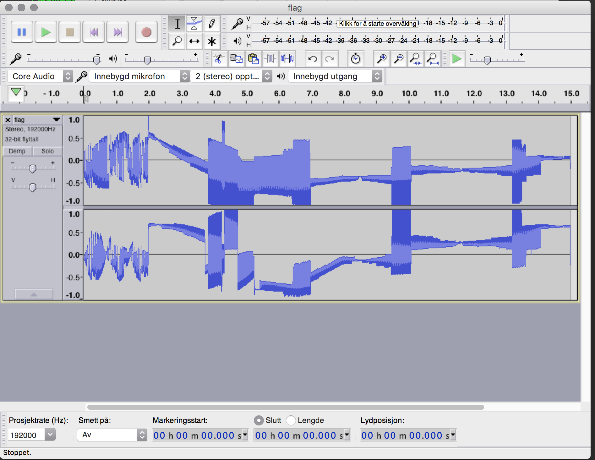
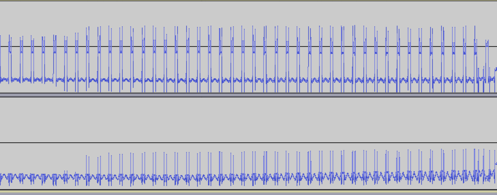

# Roadblock - writeup

The file [flag.wav](flag.wav) is made with OsciStudio

Left and right channels in Audacity.


It is a stereo track. It contains two channels. The channels are sinusoids in phase.

We can use these two channels to create coordinates in a [Lissajous_curve](https://en.wikipedia.org/wiki/Lissajous_curve) on an oscilloscope in  xy-mode.

With a tool like [osci player](https://oscilloscopemusic.com/osci.php) or a oscilloscope in xy-mode/lissajous mode and then we can get the flag.


the flag is:

 

```
TG18{This_IS_music}
```
