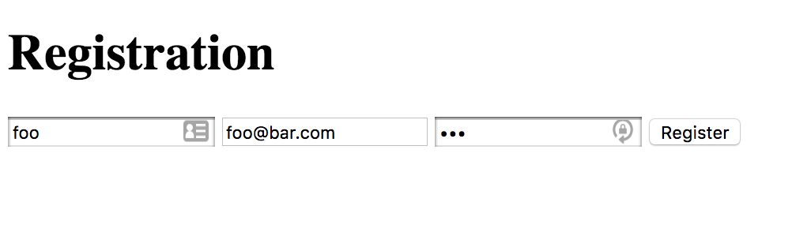
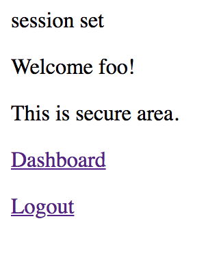
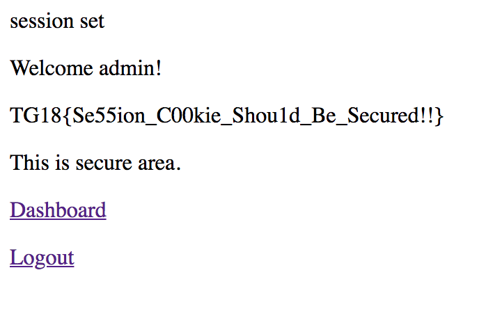

# Register Writeup

When opening the provided URL (https://reg.tghack.no), we're presented with a login page.

The bottom of the page contains a hint: `Make me admin, please!!!`. At first, it looks like an SQL injection task because of the login form, but it is possible to register a user, so we decided to look into that functionality first.

After logging in with our newly created user, we end up on the following page:

It's interesting to note the text at the top of the page: `session set`. Let's see if we can find anything interesting in the session cookie! There are several ways to read cookies. Two simple ways are using the Chrome extension `EditThisCookie`, or the console in the `Inspect` window. You may read the cookie in the console by entering `document.cookie`.

We see that the page provides one cookie called `PHPSESSID` and one called `User`. The `User` cookie simply contains our username. We can try to change our username to `admin` either by using the Chrome extention, the console in the inspect window, Burp Suite, curl, or any other tool that does the job. After changing the cookie, we end up logged in as the admin user, and we get the flag!

